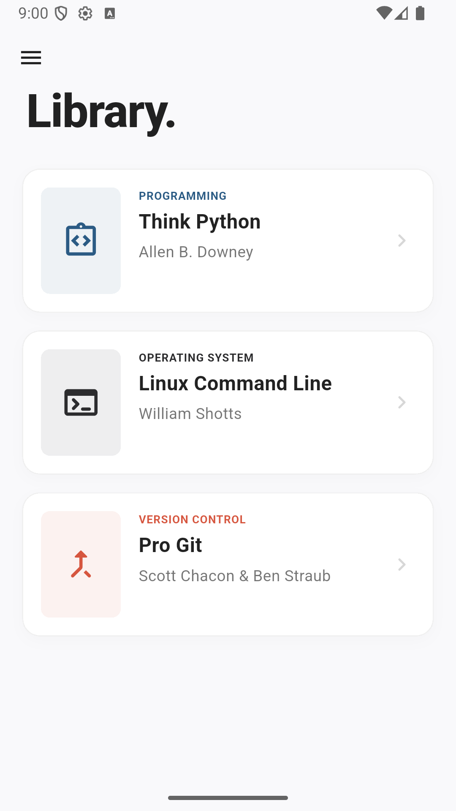
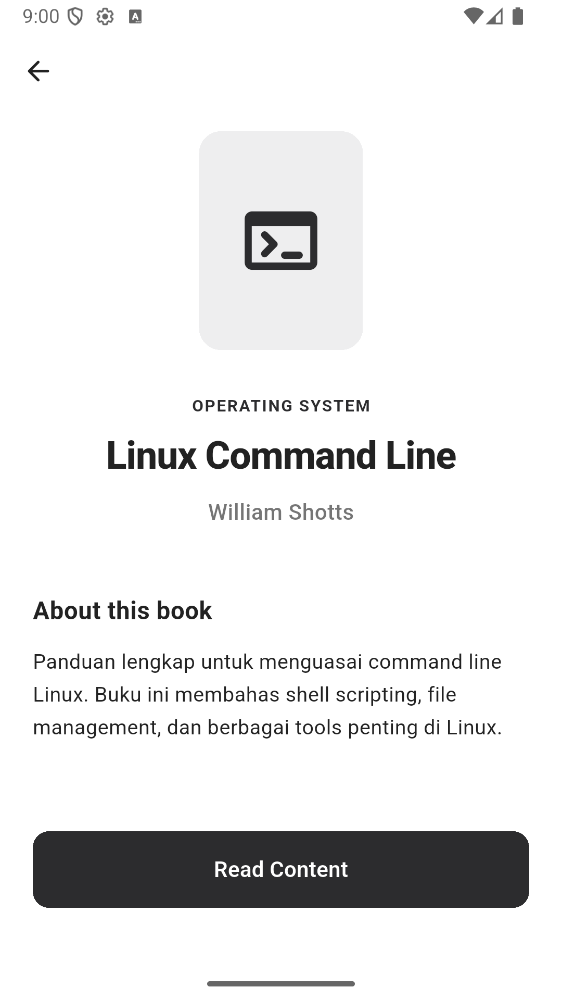
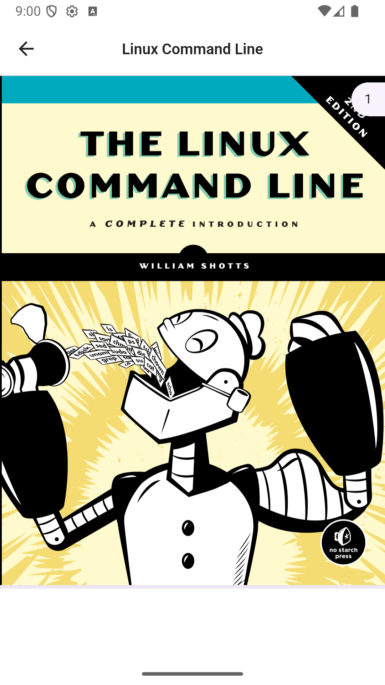

# Navigasi dan Route - Flutter

Aplikasi Flutter sederhana untuk tugas mata kuliah Pemrograman Mobile. Project ini dibuat untuk belajar cara kerja navigasi dan routing di Flutter.

## Screenshot

<p align="center">
  
  &nbsp;&nbsp;
  
  &nbsp;&nbsp;
  
</p>

<p align="center">
  <em>Halaman Utama &nbsp;&nbsp;&nbsp;&nbsp;&nbsp;&nbsp;&nbsp;&nbsp;&nbsp;&nbsp;&nbsp;&nbsp;&nbsp;&nbsp; Detail Buku &nbsp;&nbsp;&nbsp;&nbsp;&nbsp;&nbsp;&nbsp;&nbsp;&nbsp;&nbsp;&nbsp;&nbsp;&nbsp;&nbsp;&nbsp;&nbsp; PDF Reader</em>
</p>

## Tentang Project

Project ini awalnya berisi contoh-contoh percabangan dan perulangan (if/else, switch/case, while), tapi saya kembangkan lagi jadi aplikasi perpustakaan buku sederhana yang mendemonstrasikan cara kerja navigasi antar halaman di Flutter.

Fitur yang ada:
- Halaman utama dengan daftar 10 buku
- Halaman detail tiap buku
- PDF reader untuk membuka file buku langsung dari aplikasi
- Drawer menu navigasi ke halaman contoh if/else, switch/case, while/do

## Daftar Buku

| No | Judul | Penulis | Kategori |
|----|-------|---------|----------|
| 1 | Think Python | Allen B. Downey | Programming |
| 2 | Linux Command Line | William Shotts | Operating System |
| 3 | Pro Git | Scott Chacon & Ben Straub | Version Control |
| 4 | Clean Code | Robert C. Martin | Best Practice |
| 5 | The Pragmatic Programmer | Andrew Hunt & David Thomas | Career |
| 6 | Introduction to Algorithms | Cormen, Leiserson, Rivest & Stein | Algorithm |
| 7 | Design Patterns | Gang of Four | Architecture |
| 8 | Eloquent JavaScript | Marijn Haverbeke | Web Development |
| 9 | Operating Systems: Three Easy Pieces | Remzi & Andrea Arpaci-Dusseau | Operating System |
| 10 | Computer Networking: A Top-Down Approach | Kurose & Ross | Networking |

## Cara Kerja Navigasi

Ada dua cara navigasi yang dipakai di project ini:

**Named Route** (untuk drawer menu):
```dart
Navigator.pushNamed(context, '/if-else');
```

**MaterialPageRoute** (untuk halaman buku):
```dart
Navigator.push(
  context,
  MaterialPageRoute(builder: (context) => BookDetailPage(book: book)),
);
```

## Setup

### Requirement
- Flutter SDK
- Emulator / device fisik

### Jalankan Project

```bash
flutter pub get
flutter run
```

### File PDF

Taruh file PDF di folder `assets/pdf/` dengan nama berikut:

```
assets/pdf/
├── thinkpython2.pdf
├── thelinuxcommandline.pdf
├── progit.pdf
├── cleancode.pdf
├── pragmaticprogrammer.pdf
├── introalgorithms.pdf
├── designpatterns.pdf
├── eloquentjavascript.pdf
├── ostep.pdf
└── computernetworking.pdf
```

## Library yang Dipakai

- `syncfusion_flutter_pdfviewer` — untuk menampilkan PDF

## Struktur Navigasi

```
Halaman Utama (10 Buku)
├── (Drawer) → /if-else
├── (Drawer) → /switch-case
├── (Drawer) → /while-do
└── (Tap buku) → BookDetailPage
                      └── (Tombol Read) → PdfViewerPage
```

## Info

| | |
|---|---|
| **Nama** | Afrizal Fikri |
| **NIM** | L200230195 |
| **Mata Kuliah** | Pemrograman Mobile |
| **Tugas** | Tugas 2 Pertemuan 6 - Navigasi dan Route |
